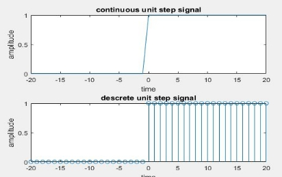
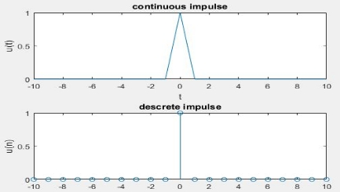
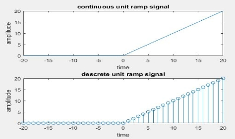
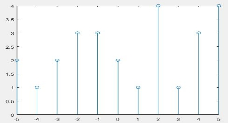
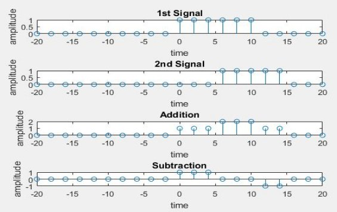
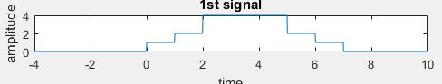

**Experiment No:** 01

**Experiment Date:** 20.03.2023

**Experiment Name:** 

1. Plot unit step, unit ramp, unit impulse signal using MATLAB without using built in functions. 
1. Plot discrete signal using MATLAB.
1. Plot two different discrete signal and show their addition and subtraction using MATLAB.  
1. Plot two different continuous signal using MATALB.  

**Theory:** 

**Continuous & Discrete Signal:** As the name implies, continuous signals are uninterrupted. They represent data for every instant of time. While discrete signals comprise a finite number of discrete values. They represent data at a specific instance in time.

**Unit Step Signal:** If a step signal has unity magnitude, then it is known as unit step signal or unit step function. It is denoted by u(t). The step signal is equivalent to applying a signal to a system whose magnitude suddenly changes and remains constant forever after application.

**Unit Impulse Signal:** The unit impulse function or Dirac delta function, denoted δ(t), is usually taken to mean a rectangular pulse of unit area, and in the limit the width of the pulse tends to zero whilst its magnitude tends to infinity.

**Unit Ramp Signal**: A ramp function** or** ramp signal is a type of standard signal which starts at 𝑡 = 0 and increases linearly with time. The unit ramp function has unit slop.

**Code:**

1) **Code for Unit Step Signal:**

clc;

clear all;

close all;

t=-20:1:20;

for i=1:length(t)

`    `if t(i)>=0

`        `x(i)=1;

`    `else 

`        `x(i)=0;

`    `end

end

subplot(2,1,1)

plot(t,x)

title('continuous unit step signal')

xlabel('time')

ylabel('amplitude')

subplot(2,1,2)

stem(t,x)

title('descrete unit step signal')

xlabel('time')

ylabel('amplitude')

**Output of Unit Step Signal:**

`                        `

`                            `Figure 1.1: Unit step for continuous and discrete signal

**Code for Unit Impulse Signal:**

n=-10:10;

u=[zeros(1,10) 1 zeros(1,10)];

subplot(2,1,1)

plot(n,u)

xlabel('t');

ylabel('u(t)');

title('continuous impulse');

subplot(2,1,2)

stem(n,u)

xlabel('n');

ylabel('u(n)');

title('descrete impulse');

**Output of Unit Impulse Signal:**

`           `Figure 1.2: Unit Impulse for continuous and discrete signal

                    

` `**Code for Unit Ramp Signal:**

clc;

clear all;

close all;

t=-20:1:20;

for i=1:length(t)

`    `if t(i)>=0

`        `x(i)=t(i);

`    `else 

`        `x(i)=0;

`    `end

end

subplot(2,1,1)

plot(t,x)

title('continuous unit ramp signal')

xlabel('time')

ylabel('amplitude')

subplot(2,1,2)

stem(t,x)

title('descrete unit ramp signal')

xlabel('time')

ylabel('amplitude')

**Output of Unit Ramp Signal:**

`                    `

`                                     `Figure 1.3: Unit Ramp for continuous and discrete signal

1) **Code for Discrete Signal:**

`    `x = -5:5

`    `y = [2,1,2,3,3,2,1,4,1,3,4]

`    `stem(x,y);

**Output of Discrete Signal:**

`             `

`                                              `Figure 1.4 : Discrete Time Signal

1) **Code for plotting two different discrete signal and show their addition and subtraction:**

`    `clc

`    `clear all

`    `close all

`    `t = -20:2:20

`    `n1 = t>=0 & t<=10

`    `subplot(4,1,1);

`    `stem(t,n1);

`    `xlabel('time');

`    `ylabel('amplitude');

`    `title('1st Signal');

`    `n2 = t>=5 & t<=15

`    `subplot(4,1,2);

`    `stem(t,n2);

`    `xlabel('time');

`    `ylabel('amplitude');

`    `title('2nd Signal');

`    `add = n1+n2

`    `subplot(4,1,3);

`    `stem(t,add);

`    `xlabel('time');

`    `ylabel('amplitude');

`    `title('Addition');

`    `sub = n1-n2

`    `subplot(4,1,4);

`    `stem(t,sub);

`    `xlabel('time');

`    `ylabel('amplitude');

`    `title('Subtraction');

**Output:**

` `Figure 1.5: plotting two different discrete signal and show their addition and subtraction

1) **Code for plotting two different continuous signal:**    
1. ` `clc
1. clear all
1. close all
1. t = -10:0.01:20
1. n1 = t>=0 & t<=7
1. n2 = t>=1 & t<=6
1. n3 = t>=2 & t<=5
1. s1 = n1+n2+2\*n3;
1. subplot(4,1,1);
1. plot(t,s1);
1. xlabel('time');
1. ylabel('amplitude');
1. title('1st signal');

Output of the first signal:

`                                  `Figure 1.6: Plotting a continuous signal

**Discussion:** In this experiment various types of discrete and continuous signals were given to implement on MATLAB such unit step, unit impulse, unit ramp, discrete signals, addition and subtraction of two discrete signals and plotting two random continuous signals. We implemented the given task on MATLAB using corresponding code.

For unit step signal I have used for and if else condition. For plotting unit step signal a range t was declared. Unit step signal will be t greater than zero which was ensured using for condition. For unit impulse signal the condition was totally different. There was only 1 in zero position and all the positions were kept 0. Then using plot and subplot unit impulse signal of  discrete and continuous signals were demonstrated. For unit ramp signal almost same code is applied which was applied for unit step. A little difference is here in if condition x(i)=t(i) was considered and for unit step it was x(i)=i.

A random discrete signal was plotted using stem. The range is taken from -5 to 5 and their corresponding values were taken and using stem the discrete signal was obtained.

Then two discrete signals were given. For the first signal, in n=0:10 the value was 1 and 0 for all other cases. In case of second signal, the value was 1 for only n=5:15. Then these two signals were added and finally subtracted second signal from first signal.

In the last part of this experiment, two random continuous signals were given to plot on MATLAB. I tried so hard to implement it and successfully demonstrated the first signal. But I could not complete the second signal.

**Conclusion:** Form this experiment, we had learned about different types of signal and how to plot them using MATLAB. 

