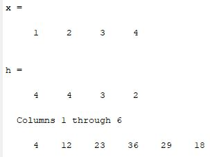
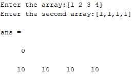

`                                                                 `*Heaven’s Light is Our Guide*

`     `**Rajshahi University of Engineering & Technology**    

`                                                                  `

`          `Department of Electrical & Computer Engineering

`                                     `**LAB REPORT**

**Course No:** ECE 4124

**Course Title:** Digital Signal Processing Sessional

**Submitted To :**

Hafsa Binte Kibria

Lecturer

Dept. of ECE,RUET

**Submitted By:**

**Name:** M.Morsedur Rahman

**Roll:**1810059

**2.1 Experiment No:** 02

**2.2 Experiment Name:**  

1. Take two signals and show the convolution using tabular method in MATLAB.
1. Take two signals and show the convolution using circular method in MATLAB.

**2.3 Theory:** Convolution is a mathematical operation used to express the relation between input and output of an LTI system. It relates input, output and impulse response of an LTI system as  **y(t)=x(t)∗h(t).** Where y (t) = output of LTI

x (t) = input of LTI

h (t) = impulse response of LTI

There are two types of convolutions:

- Continuous convolution
- Discrete convolution

Convolution is a formal mathematical operation, just as multiplication, addition, and integration. Addition takes two numbers and produces a third number, while convolution takes two signals and produces a third signal. Convolution is used in the mathematics of many fields, such as probability and statistics. In linear systems, convolution is used to describe the relationship between three signals of interest: the input signal, the impulse response, and the output signal.

**2.4   Code for convolution using tabular method:**

clc

clear all

x=[1 2 3 4]

h=[4 4 3 2]

a=length(x);

b=length(h);

n=a+b-1;

y=zeros(1,n);

l=1:n;

for i=0:n

`    `for j=0:n

`        `if((i-j+1)>0 && (i-j+1)<=b && (j+1)<=a)

`            `y(i+1)=y(i+1)+x(j+1).\*h(i-j+1);

`        `end

`    `end

end

disp(y)

subplot(3,1,1)

stem(x)

xlabel('n');

ylabel('x[n]');

subplot(3,1,2)

stem(h)

xlabel('n');

ylabel('h[n]');

subplot(3,1,3);

stem(l,y)

xlabel('n');

ylabel('y[n]');

**Output:**

`                      `

`       `Figure 2.1: Convolution of two discrete signals using tabular method

**Output Signal:**

`                           `Figure 2.2: Showing two input signals with the output signal

**2.5 Code for convolution using circular method:**

clc

clear all

close all

z=[];

x=input('Enter the array:');

l1=length(x);

h=input('Enter the second array:');

l2=length(h);

if(l1>l2)

`    `c=l1-l2;

`    `for i=1:c

`        `h=[h 0];

`    `end

else

`    `(l2>l1)

`    `c=l2-l1;

`    `for i=1:c

`        `x=[x 0];

`    `end

end

`        `z=[z h'];

`        `a=h;

`        `for i=1:length(h)-1

`            `a=ci(a);

`            `z=[z a'];

`        `end

`        `y=z\*x';

`        `disp(y');

subplot(3,1,1)

stem(x)

xlabel('n');

ylabel('x[n]');

subplot(3,1,2)

stem(h)

xlabel('n');

ylabel('h[n]');

subplot(3,1,3);

stem(y)

xlabel('n');

ylabel('y[n]');     

ci.m

function a=ci(m)

x1=m;

a=[];

c=length(x1);

a=[a x1(c)];

for i=1:length(x1)-1

`    `a=[a x1(i)];

end

end

**Output:**

`                                `

`               `Figure 2.3: Convolution of two discrete method using circular method

**Output:**

`                           `Figure 2.4: Showing two input signals with the output signal

**2.6 Discussion:** In this experiment we have learnt about convolution method using tabular method and circular method with the help of MATLAB. For tabular method, first we took two matrices. Then the length of the matrices was calculated. The number of iterations was calculated using a particular formula. In tabular method, normally a rectangular table is formed by the elements of x matrix in row and the elements of h matrix in column or vice versa. After that it is needed to multiply the element of x(n) with the element of h(n). Then the sum is taken diagonally. Tabular method can only be used with finite duration discrete time signal. So this concept was also handled in code. The signal of x(n), h(n) and their convolution output were plotted in MATLAB.

For circular convolution, the strategy was totally different. In circular convolution, both the sequence must have same length. In this case, One sequence is written as the column of a matrix. Then the last element of the first column goes to the first of the next column. Other elements come sequentially. This process continues until the same column returns just like the first column. Another sequence has to be written as column matrix. Then performing a simple matrix multiplication will give the result of circular convolution. In this way, the MATLAB code was performed. The Output result and experimental graph were shown using MATLAB.

**2.7 Conclusion**: We have learnt the experimental concept of convolution using tabular method and circular method using MATLAB. We successfully completed the experiment as we got the exactly same result which we learnt from theoretical concept.

