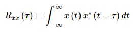
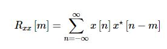
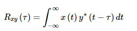
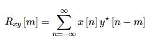
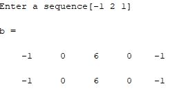
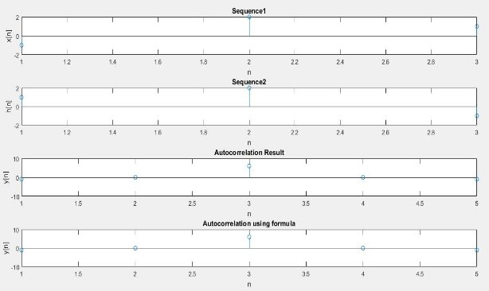
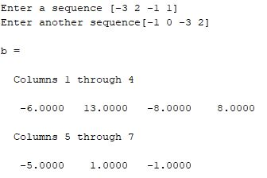
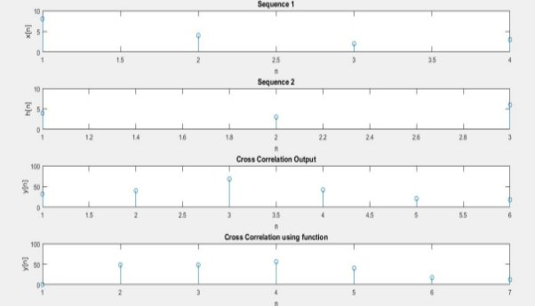

`                                                                 `*Heaven’s Light is Our Guide*

`     `**Rajshahi University of Engineering & Technology**    

`                                                                  `

`          `Department of Electrical & Computer Engineering

`                                     `**LAB REPORT**

**Course No:** ECE 4124

**Course Title:** Digital Signal Processing Sessional

**Submitted To :**

Hafsa Binte Kibria

Lecturer

Dept. of ECE,RUET

**Submitted By:**

**Name:** M.Morsedur Rahman

**Roll:**1810059

**3.1 Experiment No:** 03

**3.2 Date of Experiment:**07.05.2023

**3.2 Experiment Name:**

1. Study of autocorrelation using MATLAB
1. Study of cross correlation using MATLAB

**3.3 Theory:** Cross correlation happens when two different sequences are correlated. Autocorrelation is the correlation between two of the same sequences. Cross correlation happens when two different sequences are correlated. Autocorrelation is the correlation between two of the same sequences.

Auto correlation: This is a type of correlation in which the given signal is correlated with itself, usually the time-shifted version of itself. Mathematical expression for the autocorrelation of continuous time signal x (t) is given by

`                         `

` `Similarly the autocorrelation of the discrete time signal x[n] is expressed as

`                                            `

Next, the autocorrelation of any given signal can also be computed by resorting to graphical technique. The procedure involves sliding the time-shifted version of the given signal upon itself while computing the samples at every interval. That is, if the given signal is digital, then we shift the given signal by one sample every time and overlap it with the original signal. While doing so, for every shift and overlap, we perform multiply and add.

Cross Correlation: This is a kind of correlation, in which the signal in-hand is correlated with another signal so as to know how much resemblance exists between them. Mathematical expression for the cross-correlation of continuous time signals x (t) and y (t) is given by

`                                           `

Similarly, the cross-correlation of the discrete time signals x [n] and y [n] is expressed as

`                                             `

Next, just as is the case with autocorrelation, cross-correlation of any two given signals can be found via graphical techniques. Here, one signal is slid upon the other while computing the samples at every interval. That is, in the case of digital signals, one signal is shifted by one sample to the right each time, at which point the sum of the product of the overlapping samples is computed.

**3.4 Code of Autocorrelation:**

clc

clear all

x=input('Enter a sequence');

h=fliplr(x);

a=length(x);

b=length(h);

n=a+b-1;

y=zeros(1,n);

l=1:n;

for i=0:n

`    `for j=0:n

`        `if((i-j+1)>0 && (i-j+1)<=b && (j+1)<=a)

`            `y(i+1)=y(i+1)+x(j+1).\*h(i-j+1);

`        `end

`    `end

end

b=xcorr(x,x)

disp(y)

subplot(4,1,1)

stem(x)

xlabel('n');

ylabel('x[n]');

title('Sequence1');

subplot(4,1,2)

stem(h)

xlabel('n');

ylabel('h[n]');

title('Sequence2');

subplot(4,1,3);

stem(l,y)

xlabel('n');

ylabel('y[n]');

title('Autocorrelation Result');

subplot(4,1,4);

stem(b)

xlabel('n');

ylabel('y[n]');

title('Autocorrelation using formula');

**3.5 Output :**

`                               `

**3.6 Output Waveshape:**

`                                              `Figure 3.1: Autocorrelation Output 

**3.7 Code of Cross Correlation:**

clc

clear all

x=input('Enter a sequence');

h=input('Enter another sequence');

a=length(x);

b=length(h);

n=a+b-1;

y=zeros(1,n);

l=1:n;

for i=0:n

`    `for j=0:n

`        `if((i-j+1)>0 && (i-j+1)<=b && (j+1)<=a)

`            `y(i+1)=y(i+1)+x(j+1).\*h(i-j+1);

`        `end

`    `end

end

b=xcorr(x,h)

disp(y)

subplot(4,1,1)

stem(x)

xlabel('n');

ylabel('x[n]');

title('Sequence 1');

subplot(4,1,2)

stem(h)

xlabel('n');

ylabel('h[n]');

title('Sequence 2');

subplot(4,1,3);

stem(l,y)

xlabel('n');

ylabel('y[n]');

title('Cross Correlation Output');

subplot(4,1,4);

stem(b)

xlabel('n');

ylabel('y[n]');

title('Cross Correlation using formula');

**3.8 Output:** 

`                       `

**3.9 Output Waveshape:**

`                                                  `Figure 3.2: Cross Correlation

**3.10: Discussion:** In this we have experimented autocorrelation and cross correlation methods.

For autocorrelation, we have used same sequence but one of the two is time shifted version of the another. In code, I have taken a sequence and flip that sequence to get the time shifted version. For flipping the sequence, I have used fliplr() function. Then normally I have implemented the code for tabular method.

For tabular method, first I took two matrices. Then the length of the matrices was calculated. The number of iterations was calculated using a particular formula. In tabular method, normally a rectangular table is formed by the elements of x matrix in row and the elements of h matrix in column or vice versa. After that it is needed to multiply the element of x(n) with the element of h(n). Then the sum is taken diagonally. Tabular method can only be used with finite duration discrete time signal. So this concept was also handled in code. The signal of x(n), h(n) and their autocorrelation output were plotted in MATLAB. Also the result was checked using the autocorrelation function.

For implementing cross correlation I have taken two different sequences and used tabular method again. The signal of x(n), h(n) and their cross correlation output were plotted in MATLAB. Also the result was checked using the cross correlation function.

**3.11 Conclusion:** We successfully completed the lab as the output waveshape on MATLAB were exactly similar which we learnt from theory.

