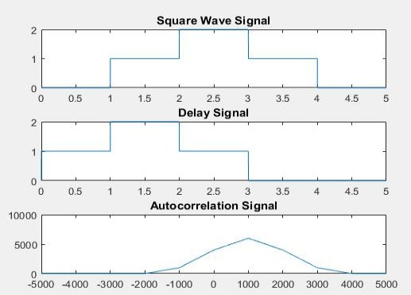
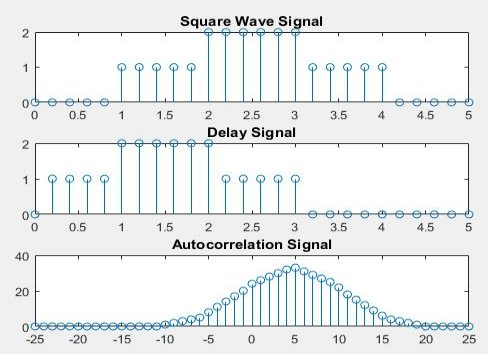
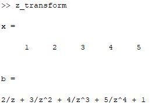
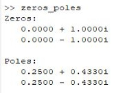

`                                                                 `*Heaven’s Light is Our Guide*

`     `**Rajshahi University of Engineering & Technology**    

`                                                              `

`          `Department of Electrical & Computer Engineering

`                                     `**LAB REPORT**

**Course No:** ECE 4124

**Course Title:** Digital Signal Processing Sessional

**Submitted To :**

Hafsa Binte Kibria

Lecturer

Dept. of ECE,RUET

**Submitted By:**

**Name:** M.Morsedur Rahman

**Roll:**1810059

Dept. of ECE,RUET

**4.1 Experiment No:** 04

**4.2 Experiment Date:** 14.05.2023

**4.2 Experiment Name:** 

1. Find delay of signals (continuous and discrete) using autocorrelation.
1. Find the Z transform of a discrete signal using MATLAB.
1. Find Zeroes and Poles using MATLAB.

**4.3 Theory:** Autocorrelation is a mathematical representation of the degree of similarity between a given time series and a lagged version of itself over successive time intervals. Thus, the autocorrelation is the correlation of a signal with itself. Autocorrelation is useful for finding repeating patterns in a signal, such as determining the presence of a periodic signal which has been buried under noise or identifying the missing fundamental frequency in a signal implied by its harmonic frequencies.

Time delay analysis finds the delay (also called the “lag”) between two signals, that are shifted in time. By using autocorrelation method, the time delay can be measured.

<b>z- transform:</b> A z-Transform is important for analyzing discrete signals and systems. We know analog signals or signals that are continuous in the time domain. But modern-day communication and system are based on digital processing. This forces us to change our analog signals to the digital domain. The first step in doing this is to sample the analog signal at a rate above a threshold (known as Nyquist sampling rate) as a discrete sequence of points. These points are discretized in time. Each sample occurs at <i>t=nTs</i>, where <i>Ts</i> is the sampling time. After sampling, we need to quantize these samples to one out of M given levels and then encode the quantized samples to binary for further storing, analyzing, or transmitting. 

**Poles and Zeroes:** The z-plane pole-zero plot is a very useful tool to analyze a digital system. This graphical technique allows us to gather information about various characteristics of a digital system, including its stability.

The pole-zero plot has the following features:

1. The horizontal axis is the real part of the variable z, and the vertical axis represents the imaginary part of the variable z.
1. The z-plane is divided into two parts by a unit circle.
1. Each pole is marked on the z-plane with the cross symbol × and each zero is marked with the zero (small circle) symbol O.

**4.4 Code for autocorrelation of continuous signal**

clear all;

close all;

clc

fs=1000;

t=0:1/fs:5;

s1=t>=1&t<=4;

s2=t>=2 & t<=3;

s=s1+s2;

d1=t>0 & t<=3;

d2=t>=1 & t<=2;

d=d1+d2;

Maxlength=length(t)-1;

A=-Maxlength:Maxlength;

C=xcorr(s,d);

subplot(3,1,1)

plot(t,s)

title('Square Wave Signal');

subplot(3,1,2)

plot(t,d)

title('Delay Signal');

subplot(3,1,3)

plot(A,C)

title('Autocorrelation Signal');

**Output:**

`           `****

`                                  `**Figure 4.1: Autocorrelation of continuous signal**

**4.5 Code for autocorrelation of discrete signal**

clear all;

close all;

clc

fs=5;

t=0:1/fs:5;

s1=t>=1&t<=4;

s2=t>=2 & t<=3;

s=s1+s2;

d1=t>0 & t<=3;

d2=t>=1 & t<=2;

d=d1+d2;

Maxlength=length(t)-1;

A=-Maxlength:Maxlength;

C=xcorr(s,d);

subplot(3,1,1)

stem(t,s)

title('Square Wave Signal');

subplot(3,1,2)

stem(t,d)

title('Delay Signal');

subplot(3,1,3)

stem(A,C)

title('Autocorrelation Signal');

**Output:**

`              `****

`        `**Figure 4.2: Autocorrelation of continuous signal**

**4.6 Code for Z transform of a signal**

x=[1 2 3 4 5]

b=0;

n=length(x);

y=sym('z');

for i=1:n

`    `b=b+x(i)\*y^(1-i);

end

display(b)

**Output:**

`                                       `****

`                                       `**Figure 4.3: Z transform of a signal**

**4.7 Code for poles and Zeros of  Z function:**

% Define the coefficients of the numerator and denominator polynomials

num = [1 0 1];       % Numerator coefficients (example: z^2 + 1)

den = [1 -0.5 0.25]; % Denominator coefficients (example: z^2 - 0.5z + 0.25)

% Find the degree of the numerator and denominator polynomials

num\_degree = length(num) - 1;

den\_degree = length(den) - 1;

% Find the zeros and poles

zeros\_tf = roots(num);

poles\_tf = roots(den);

% Display the results

disp('Zeros:');

disp(zeros\_tf);

disp('Poles:');

disp(poles\_tf);

**Output:**

`                                   `****

`                   `**Figure 4.4: Zeros and poles of a Z function**

**4.8 Discussion:** In this experiment, we learnt about autocorrelation, z transform, poles and zeros of z transform. Autocorrelation is a measure of similarity or correlation between a signal and a time-shifted version of itself. It quantifies the relationship between the signal's values at different time instants. Autocorrelation can be used to measure time delays between signals. By analyzing the autocorrelation function, we can identify the lag at which the autocorrelation is maximized, which corresponds to the time delay between the signals.

The Z-transform operates on discrete-time signals, which are sequences of values defined at specific time instances (usually indexed by integers). By applying the Z-transform to a discrete-time signal, we can convert it from the time domain to the Z-domain.

The Z-transform provides a useful representation of discrete-time signals in terms of a complex variable z. By analyzing the properties of the Z-transform, such as poles and zeros in the Z-plane, we can gain insights into the characteristics of the signal, such as its frequency response, stability, and causality.

Basically, Zeros are the values of z for which the numerator of the transfer function becomes zero. In other words, a zero is a value of z that makes the output of the system zero. Poles are the values of z for which the denominator of the transfer function becomes zero. In this case, the transfer function approaches infinity. Poles represent the points in the z-plane where the transfer function has singularities.

**4.9 Conclusion**: We successfully completed the experiment as we got the almost same result which we learnt from theory.

